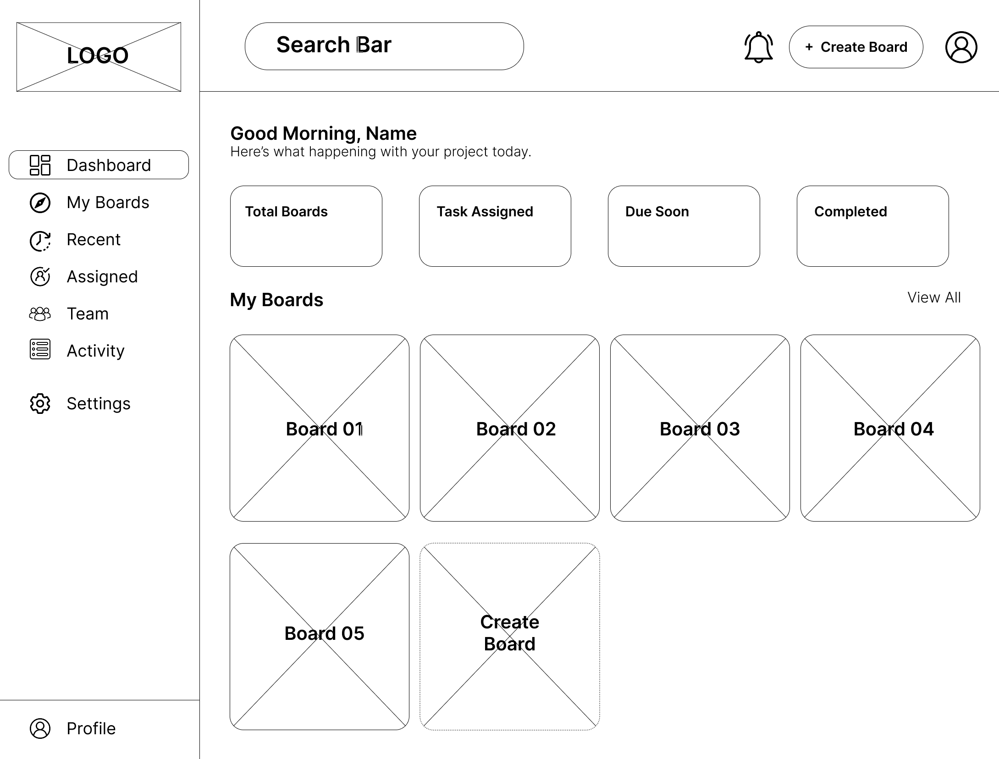

# CollabBoard

A collaborative Kanban-style task board where a small team can create boards, add tasks, move tasks between columns, and see teammates' changes update live.

## Tech Stack
- **Frontend:** React, Vite, CSS
- **Backend:** Node.js, Express (WIP)
- **Database:** MongoDB via Mongoose (WIP)

## Architecture & Design

### React Component Tree
Our static UI follows this clean, reusable hierarchical structure:
```text
App
 ├── Navbar
 └── Board
      └── Column (Reusable for To Do, Doing, Done)
           └── TaskCard (Reusable for individual tasks)
```

[View full React Component Tree Diagram (Draw.io)](design/architecture/CollabBoard%20-%20React%20Tree%20Architecture.drawio)

### API Contract
The complete backend REST API blueprint (including Auth, Boards, Tasks, Teams, and Profiles) has been fully documented for the front-end team to reference.
[View API Contract Blueprint](design/API_CONTRACT.md)

### Wireframes
Here are the primary layout wireframes for the application:

#### Dashboard


#### Kanban Board (My Board)


## Local Setup Instructions

1. **Clone the repository:**
   ```bash
   git clone https://github.com/Fullstack-Development-Group-Project/collabboard-app.git
   cd collabboard-app
   ```
2. **Install dependencies:**
   ```bash
   npm install
   ```
3. **Run the local development server:**
   ```bash
   npm run dev
   ```
4. Open `http://localhost:5173` in your browser.
